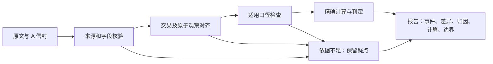

# 核验方法：事件对齐、口径归因与可追溯计算

方轩诚｜2026-10-09｜D13 比赛材料章节。对应实际规则 **D12.1**，沿用 `src_D9/attribution_D9.mjs`；事件对齐使用 D8.2，五段报告使用 D10.1。本章描述已经实现的规则和本轮复跑范围，不把队友声明、演示用例或缓存重放包装成完整系统验收。

> 2026-10-10 修订：新增第 9 节，纠正把“单位复算缺依据”合并表述成“无锚”的问题，记录新旧信封三键兼容和页面覆盖边界。第 1–8 节及原 `案例自检记录_D13.json` 保留 2026-10-09 的执行范围；旧记录内的章节哈希对应原版，不代表本次修订稿已在当日执行。本次证据另见 `三键审计记录_20261010.json`。

## 1. 核验目标与处理流程

核验的目标是判断两条披露是否具备可比条件，并解释差异。数字不同不必然是矛盾，数字相同也不必然构成互证；同公司不等于同事件。无法建立比较关系或解释差异时，系统保留观察值、来源和疑点，不补零、不猜币种、不倒算税率、不拆分个人份额。

处理分为六步：①保留 A 信封中的原文值、标准化值和出处；②验证同源解析中的页块与引文，进行有原文依据的单字段单位归一；③对齐交易及原子观察，区分同一交易与同一主体动作；④确认适用的币种、税、分母、累计和时间口径；⑤在证据充分时执行精确计算、归因或比较；⑥输出结论、计算记录及边界。跨文档算术和互证必须具备相应关系，单字段单位归一不等于已经完成事件核验。



实现是确定性规则模块，通过现有函数和 CLI 插件接口接入团队编排。模型用于上游抽取；本章三个案例的复跑不调用模型，也不等同于执行整个 DeepSeek Harness 应用。

## 2. 输入、证据与事件身份

`attributeCase(input, context)` 的业务输入为 `case_id`、`sides[]`，上下文为 `context.documents` 与 `context.parses`。比较侧包含主体、字段、数值、原始表达、单位、块标识和引文；可附有出处的事件编号、观察日、币种、税率、汇率或舍入规则。`expected_verdict`、类别标签和答辩文字不进入判定。

A 使用 v0.3 信封，保留 `raw_value/value/unit/standardized/status/provenance`。六种字段状态为 `extracted`、`not_disclosed`、`not_applicable`、`not_mentioned`、`unreadable`、`needs_review`；缺失不等于零，待复核字段不能仅因数值相同升级为互证。规则不回写原信封。

证据核对要求来源哈希相符、指定块存在、页码相符、引文可在对应块中定位；不能因为另一个块存在同一数字就移动证据。D9 还检查字段与观察的绑定。此处“核实”指固定结构化材料内的可追溯性，并非证明公告事实真实；本轮没有重新获取 PDF 并计算其字节哈希。报告层 D10 另有 region 等定位检查，不能把 D9 的块文字核对夸大为像素级回跳验收。

事件身份分两层：

- **交易关联**：标的证券、协议或交易编号、实际日期、明确买卖双方等证据支持两份文件描述同笔交易。单有公司名、金额或发布时间不够。
- **原子观察**：同一交易还可包含不同主体、方向、份额和观察时点。例如四人出让与一人受让属于同笔交易，但不能把受让合计当作每一位出让人的减持量。

D8 核心状态 `same/different/unknown` 经 B 适配为 `related/unrelated/unknown`；D9 则输出下一节的五种归因状态。两套状态不能混用。单次运行的 `event_id` 是定位信息；跨独立运行不能只按 `E01` 或数组序号认定同一事件。

## 3. 六类口径规则与计算

| 口径 | 已实现的判定与计算 | 不能推断的内容 |
| --- | --- | --- |
| 单位 | 原文明确“万/亿”等尺度才归一；万元 × 10000 得元，万股 × 10000 得股。整数和有限小数使用十进制字符串及 BigInt 运算。 | 不凭恰好相差一万倍猜单位；不跨货币与股数维度比较。 |
| 币种 | RMB 与 CNY 归为同一币种；跨币计算需明确方向、日期、来源和适用记录。若原文已披露 AED 与人民币折合值，保留双记录，不由两金额相除推广汇率。 | 不以“元”、美元符号或地区自动补币种，不获取当前汇率解释历史金额。 |
| 税口径 | 同事件且有明示税率时，含税金额 = 未税金额 × (1 + 税率/100)。D12.1 按完整税率数字匹配，`16%` 不能为 `6%` 作证。 | 未知是否含税、同时出现多个不明适用税率时保留疑点；不按金额差反推税率。 |
| 分母 | 比例需辨明所持股份、总股本、净资产或有定义的其他分母；分母不同先说明不可比。百分点差与相对变化率分开。 | 不倒算未知分母，也不因百分数相同就认为观察相同。 |
| 累计与合计 | 区分本次与累计；已证明转让关系后，按明确主体收集完整、不重复的出让量，精确求和与受让合计核对。 | 不把累计差当本次增量，不平均分摊合计。缺分项可识别口径，但必须保留“数值未勾稽”。 |
| 时间 | 区分观察日、期初/期末、事件日和发布日期；实际观察时点不同可解释为不可直接比较。更正还需旧文件、字段、公告及发布先后证据。 | 不把发布日期代替观察日，不凭“更正”二字覆盖旧值，不猜变化原因。 |

**舍入与数值稳定性。** 没有通用百分比容差；同口径精确股数只差一股也保留冲突。声明“四舍五入保留 n 位小数”时，精度以原披露单位为准：万元保留两位，对应基准元的百元精度；12345 元可舍入为 1.23 万元，12350 元应为 1.24 万元。正负半值按远离零处理。原文中的约数、暂估或上下界不能沿换汇、换税分支提前成为精确结论。

有限十进制不经二进制浮点计算金额和股数；不安全 Number、超出当前支持长度等输入保留失败或疑点。该保证限定于方规则实现，不能推广到所有队友的辅助计算分支。本轮调用明确指向方插件，且核对计算记录完整透传。

## 4. 判定状态与人工边界

| D9 `verdict` | 展示含义 | 关键限制 |
| --- | --- | --- |
| `corroborated` | 已核对的观察互证 | 不表示公告全文正确。 |
| `explainable_difference` | 可解释的口径差异 | 同时检查 `comparison_performed`、`requires_review` 和计算记录；部分覆盖不能显示为数值已通过。 |
| `restated` | 有明确依据的更正关联 | 保留旧值和更正依据。 |
| `conflict` | 同口径精确值仍不同的矛盾候选 | `requires_review=true`，交人工终审；不判断哪份披露为真或是否违法。 |
| `insufficient` | 未知／证据或上下文不足 | 不映射为“不同事件”，也不映射为“无矛盾”。 |

答辩中的“真矛盾”是**类型名称**。本包对应例是受控构造，用来证明规则不吞掉有充分可比依据的精确差异；程序仍输出待复核的矛盾候选，不声称发现上市公司真实违规。

## 5. 报告结构和接口对应

五段报告由 D10 `buildGroup` 生成：`report.events` 保留事件及来源；`report.diffs` 给出关联状态、差异和比较范围；`report.attribution` 记录归因规则；`report.calculations` 保留算式、操作数、结果和证据；`report.boundaries/boundary_details` 说明未比较或待复核部分。还保留 `report.evidence` 及运行追踪，不能为填满报告伪造计算。

报告全文不塞入 A 契约顶层；陈侧旁路报告从视图读取，避免破坏 `additionalProperties=false`。本轮检查陈当前桥接对五个演示输入信封的契约及数值保留，并核对魏 `run_d9_rules.mjs --rules` 的三个判定和 `computed[]` 与方直调一致。**本包三例是 D9 级答辩材料，不是三份新的完整 D10 多文档报告或已接通的页面演示。**

本轮还核对魏 vendor 的 `attribution_D9.mjs`、`exact_D9.mjs`、`wei_adapter_D9.mjs` 与方源文件：三者统一换行后内容一致，后两者字节一致；归因模块仅 CRLF/LF 换行不同，记录保留双方原始哈希。案例二使用张当前提交中的两份原解析；案例三使用张当前的 D6-AWD-005 原解析。都检查解析声明的源哈希与既有 A 信封一致。

## 6. 本次答辩案例及适用范围

| 案例 | 来源与内容 | 程序结论 |
| --- | --- | --- |
| D13-C01 真矛盾类型 | D12-Q04 公开受控构造，同主体、同事件键、同观察日的 1000 与 1001 股 | `conflict / SAME_BASIS_CONFLICT`，人工复核 |
| D13-C02 口径差异 | D9-RULE-005 公开公告快照，个人 3680700 股与受让合计 8427900 股 | `explainable_difference / AGGREGATE_DETAIL_RECONCILED` |
| D13-C03 未知 | D9-RULE-018 公开公告输入，金额可读但只有单侧，输入主体未指定 | `insufficient / NO_COMPARISON_CONTEXT` |

详细讲解、问答及证据位置见 `三个答辩案例_D13.md`。清单和预期在 `答辩案例_D13.json`；程序实测及来源哈希在 `案例自检记录_D13.json`。这三例不是随机抽样，也不构成准确率或召回率估计。

## 7. 与队友 D13 材料的一致性审核（2026-10-09 快照）

1. **未知样例验收不能写成完成。** 陈最新执行记录称陌生样例被 parse 哈希检查拦停，张的 D13-B1 诊断确认入库解析、锁与当前源码输出存在版本对应问题。本章不使用这些陌生样例，不绕过锁、不引用私有预期，也不把缓存复现等同陌生样例通过。固定输入哈希和生成代码版本都应记录，二者不能互相替代。
2. **成绩要限定层次和版本。** 宗 `评测章节.md` 已把首测说明为公开语料冻结回放；本章不将其中的 437/437、20/20 推广为新样本泛化能力，也不把三例自检与官方成绩相加。性能、冷跑、缓存、Web 各自的执行证据不能互换。
3. **计算缺失旧待办已有变化。** 魏现有 runner 已透传计算且增加 W7 合计辅助记录，不能照搬陈较早待办中的“尚未处理”。本包选择仍具有真实合计意义的 RULE-005，并用明确完整上下文验算四项和；不沿用宗已修订的 RULE-004 必算标签作为论据。
4. **运行环境从实测能力出发。** 魏复现说明中有 Node ≥20 的宽泛表述；方源码依赖 `.mts` 直接加载，本包实际在 Node **24.21.0** 运行，交付要求使用 Node 24.x，不承诺 Node 20 原样可跑。
5. **不把抽取弃权强改成正确答案。** 陈旧待办中的覆盖率目标、`direction` 标准化问题，应回到具体事件类型、注册表和样本分析；不能为材料好看统一补值。`pledge` 在质押方向语境有正式定义，不能仅凭该单词断言全局违反契约。

上述为本次读取版本上的核对，不对队友后续提交作预判。关键源文件和报告 SHA256 随自检记录保存。

## 8. D13 原始复跑与交付

交付为 **5 个纯新增 D13 文件**：本章、三个案例说明、案例清单 JSON、自检脚本及自检记录 JSON；不修改 D9/D12 规则，不复制队友代码、缓存或语料。合入时保持五个文件同目录即可，脚本通过参数定位各分支检出目录。

固定读取提交：方 `7e809c49a036e193df0dbd708a6d2a760d608c6b`；魏 `aa976d60b7feba36eef61a855090096d1f43e39e`；宗 `6ee49ce337cb95185955c173af05076d7a8344c9`；张 `9ce44ddb18a5570c3b917e0be170a2c7250f02f1`；陈 `e7bec616557464318fdf9813b6da683fb8b2338a`。完整版本也在案例 JSON 中。

在五个文件所在目录，用 Node 24.x 执行（示例路径需替换）：

```powershell
node .\案例自检_D13.mjs `
  --fang-root C:\repos\fang-rules `
  --wei-root C:\repos\weiwenyu `
  --zhang-root C:\repos\zhangzhibo `
  --chen-root C:\repos\cjh-workspace `
  --zong-root C:\repos\zongbowen `
  --out .\本次复跑_D13.json
```

复跑不需要密钥或模型调用，依赖上述分支中既有源码、公开样例及原解析。临时输入写系统临时目录。版本改变后应重新审阅本章与案例文字，不只更新“通过”数字。案例全部通过只说明本包的功能、算式与文字口径匹配，不声明全队所有门禁已关闭。


## 9. 三键消费与审计纠错（2026-10-10 修订）

### 9.1 问题判定：锚点强度和数值复算必须分开

`UNIT_MISSING` 是 D7 独立数值复算返回的“未取得明确单位”信号，**不能直接翻译为“原文无锚”或“抽取值错误”**。原审计路径从精简信封取表头做单位复算，却另从原解析给强度分类，两条路径没有共用完整证据，造成“strong 但因拿不到表头而被描述成无锚”的不一致。

本次新增独立复核入口 `三键审计复核_20261010.mjs`，共用选定解析视图进行锚点核对与 D7 `resolveUnitHints` 单位取证：

- 新信封优先读取 `source.parse_meta.blocks[]` 的 `source_type/table_ref/header_path`，不再要求外部解析才能看到三键。
- 老信封缺键时，通过显式 `parses-map` 回到同源解析；解析 `doc.file_sha256` 必须与信封一致。解析表头可来自块顶层或 `table_ref.header_path`，不跨列猜测。
- 单元格强锚要求对应页块、引文、`source_type=cell` 和 `table_id/cell_ref` 匹配。不能仅凭块号或数值相等认锚；错误页码、引文、表格位置或源哈希均保留疑点。
- `table_ref/header_path=null` 是合法表示。段落通常没有表格属性；单元格也可能因解析边界而没有表头路径。**键存在但值为 null，与老信封根本缺键，是不同情况。** 有表锚但无明确单位时保留强锚与 `UNIT_MISSING` 两条记录，不自造表头或单位。
- 老信封未提供可用 `parses-map` 时，返回 `LEGACY_METADATA_UNAVAILABLE_NOT_A_DEFECT`，含义为“该批不可判锚（非缺陷）”，不能直接标 `none`。冻结的 `firsttest-envelopes/` 不重造、不补写三键；本次未读取其封存内容。

复核输出是旁路审计记录，不向 v0.3 信封添加强度字段，也不回写 `status/value/standardized`。是否继续参与跨文档比较还需单位复算、事件对齐、观察时点与其余口径均通过；本记录的 `excluded_from_numeric_comparison=false` 只表示通过此处的前置筛查，不能单独推出互证或矛盾。

### 9.2 固定批次的修正前后数字

本轮读取魏提交 `2cf52956248244571c1f622fad7e17b302b70778`。旧批为 `runs/batch-20261005T063943/envelopes`，新批为 `runs/batch-20261008T010943/envelopes`；每批均为 30 份常规信封，另 1 份 `pledge-scan-degrade` 单列。每批实际纳入数值观察 181 项，本轮只做离线重放，无模型调用。

| 指标 | 旧批原审计／不取表头 | 旧批同输入＋同源 parses-map | 新批不取表头（对照） | 新批消费内嵌三键 |
| --- | ---: | ---: | ---: | ---: |
| 数值观察数 | 181 | 181 | 181 | 181 |
| D7 `NORMALIZED` | 103 | 141 | 105 | 143 |
| D7 `UNIT_MISSING` | 76 | 38 | 76 | 38 |
| D7 `UNIT_CONFLICT` | 2 | 2 | 0 | 0 |
| 已复算值与输入值不一致 | 0 | 0 | 0 | 0 |

**原 76 项逐一复核：71 项 strong、5 项 none。** “无锚”的判断需要撤回 71 项（占 76 项的 93.42%，不是“约七成”）；其中 38 项取得明确表头单位，D7 数值复算通过，另 33 项虽然定位强锚成立，但严格单位复算依据仍不足。33＋5＝38，因此不能把“76 中 71 有锚”写成“`UNIT_MISSING` 已降至 5”或“71 项数值全部核验通过”。

旧批整体强度为 **174 strong／5 none／2 conflict**；新批为 **176 strong／5 none**。新批强锚中 33 项仍未通过严格单位复算。两批 `D4-PLD-009/E03` 的两项比例 `raw_value` 已由含股数、多个比例的混合长句变为 `5.98%`、`1.24%`，故旧批两项冲突在新批消失；这属于**上游输入变化**，不能归功于本次三键消费修订。两个批次的同输入对照均只新增 38 项复算覆盖。

你本地 D7 原验收记录的 **57 项 UNIT_MISSING／121 项已复算** 来自更早的 `batch-20261002T120859`，与此次队友所指“76 项”的批次不同，保留为历史记录，不拿它作同输入比较。本轮未估计模型准确率，也没有改变 Gold 或首测分母。

### 9.3 边界实例与兼容检查

- **有锚、可复算**：表头明确单位，且单元格三重定位和引文成立；D7 可取得单位后重新计算，记录来源。
- **有锚、暂不可复算**：例如 `D5-EQC-001` 的股份表格单元格可定位，但 `header_path=null`；又如仅有“数量”表头。保留强锚，不自动把它当成“股”或“万股”。
- **确无表格锚**：`D5-EQC-010` 的 5 个裸数值观察来自段落，表格相关键合法为 null，标 `none` 并排除比较；不把 null 本身写成接口错误。

内置 **11 项兼容／反向检查通过**：明确表头、段落 null、单元格 null 表头、老信封缺键、同源回退实际参与复算、嵌套表头、错误源哈希、错误引文、错误页码、错误单元格、重复块号。两批原输入均保持不变，所有已复算值与原值数值等价。报告保存逐字段结果、采纳的页块与表头、每份输入 SHA256 及汇总指纹；没有把“有锚”冒充原始 PDF 的独立鉴证。

### 9.4 页面核验覆盖边界

截至本次读取的宗 `evaluation/D15/给方-核验覆盖权威批-20261010.md` 及 F7 审计，`/api/verify` 核验视图的旧池 `data/` 有 10 份 `.check.json`，权威池 `data_unified/` 有 **0 份**。这是**队友已记录的页面运行状态**，本轮没有启动页面重新实测，也未生成权威批次的核验侧车或修改陈的接线。

本次新批三键／D7 标准化审计与完整的事件关联、归因核验侧车不是同一层。因此材料应明确：**页面核验仅覆盖既有演示池；权威批次完整核验及页面覆盖尚未由本轮交付证明。** 不能用本次 143 项数值复算或旧 D13 三个案例，替代 31 份权威批次的完整核验验收。该项登记为已知边界，后续由方提供完整侧车、陈接入页面并实测后再更新。

### 9.5 本轮复跑与依据

```powershell
node .\三键审计复核_20261010.mjs --wei-root C:\repos\weiwenyu --out .\本次三键复核.json
```

使用 Node 24.x，魏目录应检出上述固定提交；脚本复用 `tools/fang-d7/src_D7`，不新增第三方依赖。新批直接消费信封内嵌三键；旧批默认读取 `runs/full-parses-map.json`。可用 `--old-batch`、`--new-batch`、`--parses-map` 指定其他路径；修改输入后必须重新解读数字，不能继承本表结论。源文件的 `reference_commit` 是本次交付的版本参照，实际读取文件另有 SHA256。

依据：魏 `docs/envelope-three-keys.md`、`runs/D7-normalization-audit-20261005.json`；宗 `evaluation/integration/D7-方案C-修订裁定.md`、`evaluation/D16/给方-三键消费要点-20261010.md`、上述 D15 覆盖报告。宗读取提交为 `8785d8701c012ac698a1ea44d3b9e52211bb2c49`。本轮实测结论和逐字段明细以 `三键审计记录_20261010.json` 为准，不照抄队友的预期数字。
